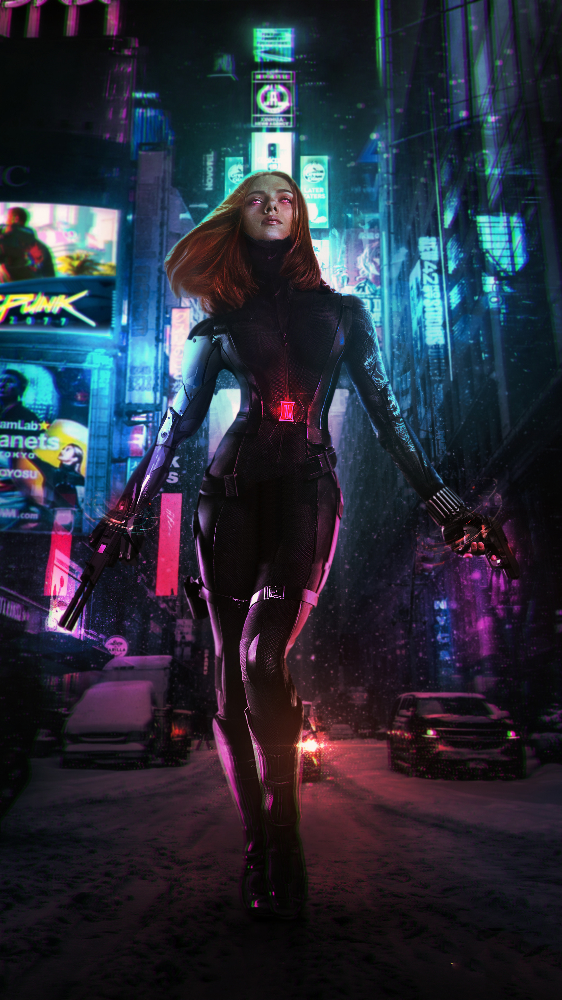

# wallpaperSpanner
Splits vertical images into two based on monitors' pixels per inch.
If you have a stacked monitors with different dpi for each, use this to scale/align your wallpaper. Works for any 4k wallpaper.

# Original Image

# Sample final image

Change settings in resclaer.py and run.

Change paths accordingly.
Assign shortcut to command "python3 /path/to/rescaler.py" for quick access
